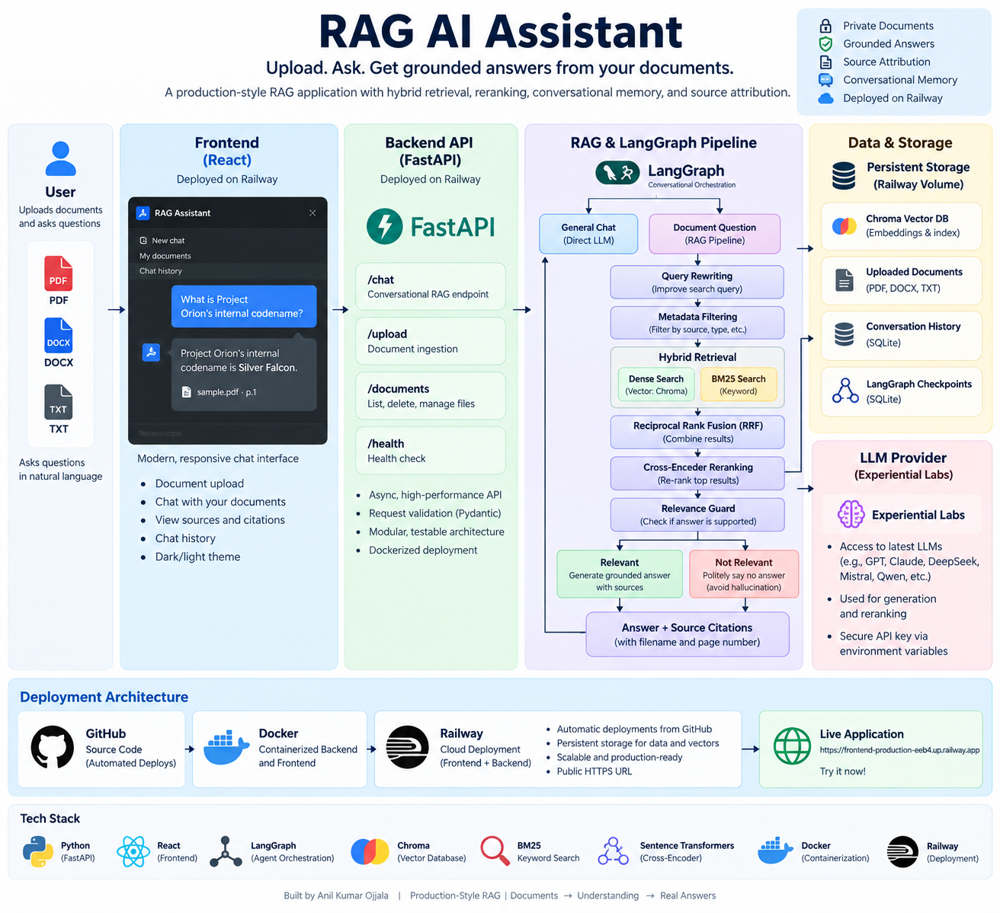

# 🧠 RAG AI Assistant

### Production-Style Conversational Document Intelligence with Hybrid Retrieval, Reranking & Persistent Memory

<p align="center">
  <strong>Upload private documents. Ask questions naturally. Get grounded answers with source citations.</strong>
</p>

<p align="center">
  <a href="https://frontend-production-eeb4.up.railway.app"><strong>🚀 Live Demo</strong></a>
  &nbsp;•&nbsp;
  <a href="#system-architecture">Architecture</a>
  &nbsp;•&nbsp;
  <a href="#getting-started">Getting Started</a>
  &nbsp;•&nbsp;
  <a href="#testing">Testing</a>
</p>

<p align="center">
  
  
  
  
  
  
  
</p>

---

## 🚀 Live Application

The complete application is deployed on Railway:

### 👉 [Launch RAG AI Assistant](https://frontend-production-eeb4.up.railway.app)

The deployed application supports document ingestion, conversational question answering, persistent chat history, source attribution, and persistent vector storage.

> **Note:** The hosted demo is intended for portfolio and development use. Availability may depend on the deployment environment and configured model provider.

---

## 📌 Overview

**RAG AI Assistant** is a production-style Retrieval-Augmented Generation application designed for conversational question answering over private documents.

Users can upload **PDF, DOCX, and TXT** files and interact with their knowledge base through a modern chat interface.

Rather than relying on vector similarity alone, the system implements a multi-stage retrieval pipeline combining:

- semantic dense retrieval
- BM25 lexical retrieval
- Reciprocal Rank Fusion
- cross-encoder reranking
- metadata-aware filtering
- relevance gating
- grounded LLM generation
- filename/page-level source attribution

LangGraph orchestrates conversational routing, query rewriting, retrieval, generation, and persistent conversational state.

The entire application is exposed through a FastAPI backend, consumed by a React frontend, containerized with Docker, tested with Pytest, and deployed to Railway with persistent runtime storage.

---

## ✨ Key Features

### 📚 Multi-Format Document Intelligence

Upload and index:

- PDF
- DOCX
- TXT

Documents are parsed, chunked, enriched with metadata, embedded, and stored in the vector database automatically.

### 🔎 Hybrid Retrieval

The retrieval engine combines two complementary search strategies.

**Dense retrieval** captures semantic similarity and meaning.

**BM25 retrieval** captures exact terminology, identifiers, product names, codes, and keyword matches.

Results from both retrieval systems are merged using **Reciprocal Rank Fusion (RRF)**.

### 🎯 Cross-Encoder Reranking

Initial retrieval candidates are scored again using a cross-encoder model.

Instead of independently embedding the query and document, the reranker evaluates the query-document pair together, improving final context selection.

### 🧠 LangGraph Conversational Orchestration

LangGraph controls the application workflow and distinguishes between general conversation and document-grounded questions.

The graph handles:

- question routing
- conversational query rewriting
- metadata filtering
- retrieval
- reranking
- relevance evaluation
- grounded generation
- no-answer handling
- persistent conversational state

### 🛡️ Relevance / No-Answer Guard

The assistant is intentionally designed **not to answer unsupported document questions confidently**.

Retrieved evidence passes through a relevance check before generation.

When sufficient evidence is unavailable, the system follows the no-answer path instead of fabricating document knowledge.

### 📎 Source Attribution

Grounded responses include document source information such as:

```text
sample.pdf · p.1
```

This allows users to understand where retrieved information originated.

### 💬 Persistent Conversations

The application stores:

- conversations
- individual messages
- timestamps
- retrieval route
- source information
- retrieval relevance state

Chat history remains accessible through the frontend sidebar.

### 💾 Persistent RAG State

Persistent runtime storage preserves:

- Chroma vector database
- uploaded documents
- conversation history
- LangGraph checkpoints

The persistence architecture was validated across backend/container redeployment.

### 🐳 Containerized Deployment

The frontend and backend are independently containerized using Docker.

Docker Compose provides reproducible local orchestration, while the production application is deployed through Railway.

---

<a id="system-architecture"></a>

# 🏗️ System Architecture



The system separates the user interface, API layer, conversational orchestration, retrieval pipeline, generation layer, and persistent storage.

---

## 🔄 RAG Pipeline

```text
                    User Question
                          │
                          ▼
                    LangGraph Router
                    ┌─────┴─────┐
                    │           │
                  Direct       RAG
                    │           │
                    │           ▼
                    │     Query Rewriting
                    │           │
                    │           ▼
                    │    Metadata Filtering
                    │           │
                    │           ▼
                    │     Hybrid Retrieval
                    │      ┌────┴────┐
                    │      │         │
                    │    Dense     BM25
                    │      │         │
                    │      └────┬────┘
                    │           │
                    │           ▼
                    │    Reciprocal Rank
                    │      Fusion (RRF)
                    │           │
                    │           ▼
                    │     Cross-Encoder
                    │       Reranking
                    │           │
                    │           ▼
                    │     Relevance Guard
                    │      ┌────┴────┐
                    │      │         │
                    │  Relevant   Unsupported
                    │      │         │
                    │      ▼         ▼
                    │  Grounded   No-Answer
                    │  Generation    Path
                    │      │
                    └──────┴─────────────
                           │
                           ▼
                    Answer + Sources
```

---

# 🔍 Retrieval Architecture

## 1. Dense Semantic Retrieval

Documents are converted into dense vector representations using:

```text
sentence-transformers/all-MiniLM-L6-v2
```

Embeddings are persisted in **Chroma**.

Dense retrieval is particularly useful when the user's wording differs from the terminology in the source document.

---

## 2. BM25 Keyword Retrieval

The project also maintains lexical retrieval using **BM25**.

BM25 improves retrieval for queries containing:

- exact names
- identifiers
- technical terminology
- codes
- product names
- uncommon keywords

---

## 3. Reciprocal Rank Fusion

Dense and BM25 results can produce scores on fundamentally different scales.

Rather than directly combining those raw scores, the system uses **Reciprocal Rank Fusion (RRF)** to combine their rankings.

Conceptually:

```text
RRF(document) = Σ 1 / (k + rank)
```

This creates a robust hybrid ranking without requiring the raw BM25 and vector similarity scores to be directly comparable.

---

## 4. Cross-Encoder Reranking

Hybrid retrieval prioritizes recall by finding a strong candidate set.

A cross-encoder then performs a more computationally expensive relevance evaluation on those candidates.

The project uses:

```text
cross-encoder/ms-marco-MiniLM-L-6-v2
```

This creates a two-stage retrieval architecture:

```text
Fast Retrieval
      ↓
Candidate Documents
      ↓
Precise Reranking
      ↓
Best Context
```

---

## 5. Relevance Guard

Even a retrieval system will return its closest available documents when the knowledge base does not actually contain the answer.

The relevance guard therefore evaluates the final retrieval result before grounded generation.

```text
Relevant evidence
      ↓
Generate grounded answer

Insufficient evidence
      ↓
Return no-answer response
```

This reduces unsupported answers and hallucination risk.

---

# 🧠 Conversational RAG with LangGraph

The system uses **LangGraph** to represent conversational RAG as a stateful workflow rather than a single linear function.

```text
START
  │
  ▼
route_question
  │
  ├──────── Direct ────────► direct_response ───► END
  │
  └──────── RAG
              │
              ▼
        rewrite_query
              │
              ▼
       metadata_filter
              │
              ▼
          retrieve
              │
              ▼
           rerank
              │
              ▼
      relevance_guard
          │       │
      Relevant  Irrelevant
          │       │
          ▼       ▼
       generate no_answer
          │       │
          └───┬───┘
              ▼
             END
```

### Why LangGraph?

A state graph makes individual RAG stages explicit and independently understandable.

It also provides a foundation for:

- persistent conversational state
- conditional routing
- query rewriting
- controlled retrieval
- multi-turn interactions
- future workflow extensions

---

# 📄 Document Ingestion Pipeline

Uploaded documents pass through a deterministic ingestion workflow:

```text
PDF / DOCX / TXT
        │
        ▼
   Document Loader
        │
        ▼
      Chunking
        │
        ▼
 Metadata Preservation
        │
        ▼
Stable SHA-256 Chunk IDs
        │
        ▼
 MiniLM Embeddings
        │
        ▼
      Chroma
```

## Stable Chunk IDs

Chunks receive deterministic SHA-256 identifiers based on document information and content.

This supports predictable indexing behavior and helps prevent duplicate vector entries.

Document deletion also removes associated vectors from Chroma.

---

# 🏷️ Metadata-Aware Retrieval

Chunk metadata includes information such as:

```text
source
file_type
page/page_label
chunk_id
```

Metadata filtering allows retrieval to be scoped to specific documents when appropriate.

For example:

```text
"What does the refund policy say?"
```

can search the full knowledge base, while:

```text
"According to refund_policy.pdf, what is the refund period?"
```

can restrict retrieval to the requested source.

---

# 🛠️ Technology Stack

| Layer | Technology |
|---|---|
| Language | Python 3.12 |
| Frontend | React |
| Backend | FastAPI |
| Validation | Pydantic |
| RAG Orchestration | LangGraph |
| LLM Integration | LangChain / OpenAI-compatible API |
| Vector Database | Chroma |
| Embeddings | Sentence Transformers / MiniLM |
| Keyword Retrieval | BM25 |
| Rank Fusion | Reciprocal Rank Fusion |
| Reranking | Cross-Encoder |
| Document Processing | PyPDF / DOCX / TXT loaders |
| Conversation Storage | SQLite |
| Graph Persistence | LangGraph SQLite Checkpointer |
| Testing | Pytest / FastAPI TestClient |
| Containers | Docker / Docker Compose |
| Cloud Deployment | Railway |
| Version Control | Git / GitHub |

---

# 🌐 API Design

The FastAPI backend exposes endpoints for conversations, document management, health checks, and conversational RAG.

### Core Endpoints

| Method | Endpoint | Purpose |
|---|---|---|
| `GET` | `/health` | Service health check |
| `POST` | `/chat` | Submit conversational RAG request |
| `POST` | `/conversations` | Create conversation |
| `GET` | `/conversations` | List conversations |
| `GET` | `/conversations/{id}` | Retrieve conversation |
| `DELETE` | `/conversations/{id}` | Delete conversation |
| `GET` | `/documents` | List indexed documents |
| `POST` | `/documents` | Upload and index document |
| `DELETE` | `/documents/{filename}` | Delete document and vectors |

FastAPI also provides interactive API documentation when running the backend locally.

---

# 💾 Persistence Architecture

Runtime state is separated from application code.

```text
runtime/
│
├── chroma_db/
│      └── vector embeddings + metadata
│
├── conversation_history.sqlite
│      └── conversations + messages
│
└── rag_checkpoints.sqlite
       └── LangGraph state

uploads/
└── user documents
```

In production, persistent Railway storage is mounted into the backend runtime environment so application state can survive service redeployment.

---

# 🐳 Docker Architecture

The project includes independent frontend and backend containers.

```text
Browser
   │
   ▼
React / Nginx Container
   │
   ▼
FastAPI Container
   │
   ▼
LangGraph + Retrieval
   │
   ├── Chroma
   ├── SQLite
   └── Uploaded Documents
```

For local development, Docker Compose orchestrates the application and persistent runtime directories.

---

# ☁️ Production Deployment

The project is deployed using:

```text
GitHub
   │
   ▼
Railway
   │
   ├── Backend Service
   │      └── FastAPI + RAG
   │
   ├── Frontend Service
   │      └── React + Nginx
   │
   └── Persistent Volume
          ├── Chroma
          ├── SQLite
          └── Uploaded Documents
```

The production deployment was validated through an end-to-end workflow:

```text
Upload Document
      ↓
Index Document
      ↓
Ask Document Question
      ↓
Hybrid Retrieval
      ↓
Grounded Answer
      ↓
Source Attribution
      ↓
Persist Conversation
      ↓
Redeploy Backend
      ↓
Verify Data + Retrieval Persistence
```

---

<a id="testing"></a>

# 🧪 Testing

The project includes automated API and RAG tests covering areas such as:

- health checks
- request validation
- conversation creation
- conversation retrieval
- conversation deletion
- document listing
- document upload
- filename sanitization
- duplicate uploads
- unsupported file rejection
- indexing failure cleanup
- document deletion
- mocked RAG API behavior
- conversational memory
- query rewriting
- routing transitions
- unsupported-question/no-answer behavior

Run the test suite with:

```bash
pytest -v
```

---

<a id="getting-started"></a>

# 🚀 Getting Started

## 1. Clone the Repository

```bash
git clone https://github.com/ANILKUMAROJJALA/rag-ai-assistant.git
cd rag-ai-assistant
```

---

## 2. Create a Virtual Environment

### Windows

```powershell
python -m venv .venv
.venv\Scripts\activate
```

### macOS / Linux

```bash
python3 -m venv .venv
source .venv/bin/activate
```

---

## 3. Install Dependencies

```bash
pip install -r requirements.txt
```

---

## 4. Configure Environment Variables

Copy:

```text
.env.example
```

to:

```text
.env
```

Configure the required LLM credentials and application settings.

Example:

```env
LLM_MODEL=your-model-name
LLM_TEMPERATURE=0

EMBEDDING_MODEL=sentence-transformers/all-MiniLM-L6-v2
RERANKER_MODEL=cross-encoder/ms-marco-MiniLM-L-6-v2

CHROMA_PERSIST_DIRECTORY=chroma_db
CHROMA_COLLECTION_NAME=technova_documents

RAW_DATA_DIRECTORY=data/raw

CHUNK_SIZE=500
CHUNK_OVERLAP=50

VECTOR_TOP_K=5
BM25_TOP_K=5
HYBRID_FINAL_K=8
GENERATION_TOP_K=2
RRF_K=60

RELEVANCE_THRESHOLD=0.0
```

> Never commit API keys or your `.env` file to source control.

---

## 5. Start the Backend

```bash
python -m uvicorn app.api.main:app --reload
```

Backend:

```text
http://127.0.0.1:8000
```

API documentation:

```text
http://127.0.0.1:8000/docs
```

---

## 6. Start the Frontend

Open another terminal:

```bash
cd frontend
npm install
npm run dev
```

Then open the local URL displayed by Vite.

---

# 🐳 Running with Docker

Build and start the complete application:

```bash
docker compose up --build
```

Frontend:

```text
http://localhost:3000
```

Backend:

```text
http://localhost:8000
```

Stop the application:

```bash
docker compose down
```

---

# 📁 Project Structure

```text
rag-ai-assistant/
│
├── app/
│   ├── api/
│   │   ├── main.py
│   │   └── history.py
│   │
│   ├── generation/
│   │   └── graph.py
│   │
│   ├── ingestion/
│   │   ├── loader.py
│   │   ├── chunking.py
│   │   ├── embeddings.py
│   │   ├── vectorstore.py
│   │   └── live_ingestion.py
│   │
│   ├── retrieval/
│   │   └── retriever.py
│   │
│   └── config.py
│
├── frontend/
│   ├── src/
│   ├── Dockerfile
│   └── package.json
│
├── tests/
│   └── test_api.py
│
├── data/
│   └── raw/
│
├── docs/
│   └── architecture.png
│
├── Dockerfile
├── docker-compose.yml
├── requirements.txt
├── pytest.ini
├── .env.example
├── .dockerignore
├── .gitignore
└── README.md
```

---

# 🧩 Engineering Decisions

### Why not use vector search alone?

Semantic retrieval is powerful but can underperform on exact identifiers and terminology. BM25 complements dense search with lexical matching.

### Why RRF instead of adding BM25 and vector scores?

The two retrieval systems produce scores with different meanings and scales. RRF combines **rank positions** instead of attempting to directly compare incompatible scores.

### Why rerank after retrieval?

Retrieving a larger candidate set improves recall. A cross-encoder can then spend more computation evaluating only those candidates and improve precision.

### Why add a relevance guard?

Retrieval systems always return their closest results. The closest result is not necessarily relevant. The guard provides an explicit decision point before generation.

### Why LangGraph?

Conversational RAG involves conditional behavior and persistent state. LangGraph makes routing, rewriting, retrieval, relevance evaluation, generation, and conversation state explicit parts of the application workflow.

### Why deterministic chunk IDs?

Stable identifiers make repeated indexing predictable and enable duplicate-safe document management.

### Why persistent storage?

A deployed application should not lose documents, vectors, conversations, or conversational state whenever a container restarts.

---

# 🔐 Security Considerations

The repository intentionally excludes runtime secrets and user data.

Sensitive configuration is supplied through environment variables.

Ignored runtime data includes:

```text
.env
vector database files
SQLite runtime databases
uploaded documents
Python virtual environments
frontend node_modules
```

For a broader production deployment, authentication, authorization, per-user document isolation, rate limiting, secret management, and additional observability would be appropriate extensions.

---

# 🗺️ Future Improvements

Potential future extensions include:

- authentication and user accounts
- per-user knowledge bases
- streaming responses
- asynchronous/background document ingestion
- richer document previews
- retrieval evaluation datasets
- observability and tracing
- CI/CD test gates
- production rate limiting
- larger-scale managed vector storage

These are intentionally kept outside the current scope so the project remains focused on a well-engineered private-document RAG architecture.

---

# 💡 What This Project Demonstrates

This project demonstrates practical experience across the complete AI application lifecycle:

**LLM Engineering**  
RAG, grounding, prompt orchestration, conversational state, and hallucination control.

**Information Retrieval**  
Dense search, BM25, RRF, metadata filtering, and cross-encoder reranking.

**Backend Engineering**  
FastAPI, validation, persistence, REST APIs, and error handling.

**Frontend Engineering**  
React-based conversational UI, document management, and chat history.

**MLOps / Deployment**  
Docker, Docker Compose, persistent cloud storage, and Railway deployment.

**Software Engineering**  
Modular architecture, deterministic ingestion, automated testing, configuration management, and Git-based development.

---

# 👨‍💻 Author

**Anil Kumar Ojjala**

Built as an AI Engineering portfolio project focused on production-style Retrieval-Augmented Generation, information retrieval, conversational AI, and full-stack deployment.

---

<p align="center">
  <strong>Built with Python • FastAPI • React • LangGraph • Chroma • Sentence Transformers • Docker • Railway</strong>
</p>